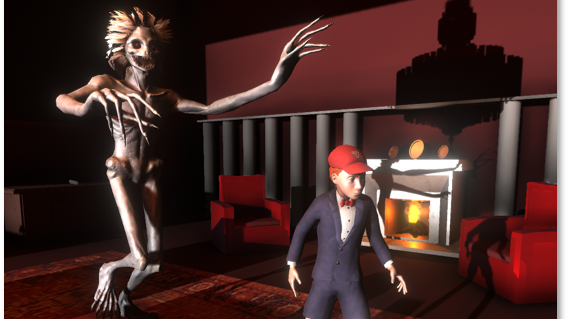

# 2.5D-Horror-Game-Code-sample

## This is a 2.5D Horror game made in Unity 3D with a small team as an experiment of University of Catania. It will be avaiable for free soon.

The player will have to find the escape route between puzzles and riddles. But he has to do it quickly, before the strange creature finds him.
In each level, the player impersonate different characters in different areas of the house. Can the player brings them all to safety?

